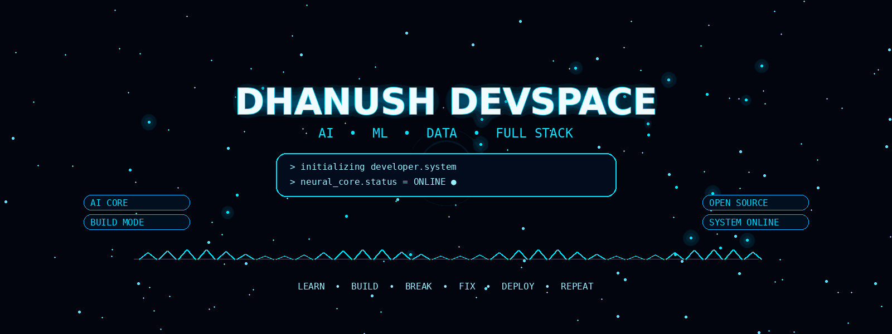
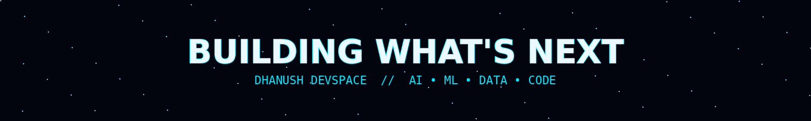

<div align="center">

<br>



<br><br>


<br>

### `CSE — DATA SCIENCE` · `AI/ML ENGINEERING` · `FULL-STACK`

<br>

[](https://github.com/dhanush080607)
[](https://dhanush-portfolio1-two.vercel.app/)
[](https://www.linkedin.com/)

</div>

<br>

---

<div align="center">

# `THE LAB`

### I build software that thinks, learns, analyzes and helps.

<br>

<table>
<tr>

<td align="center" width="25%">

### 🤖

**AI**

Generative AI
LLM Applications
AI Workflows

</td>

<td align="center" width="25%">

### 🧠

**ML**

Prediction
Classification
Modeling

</td>

<td align="center" width="25%">

### 📊

**DATA**

Analysis
Visualization
Insights

</td>

<td align="center" width="25%">

### ⚡

**BUILD**

Frontend
Backend
Deployment

</td>

</tr>
</table>

</div>

---

# `01` / NOW

<div align="center">

### CURRENTLY BUILDING

# 🧠 INSIGHTAI

**An AI-native data intelligence platform**

<br>

`RAW DATA` → `UNDERSTANDING` → `INSIGHTS` → `DECISIONS`

<br>


<br><br>

`Pandas` · `NumPy` · `Scikit-learn` · `Gemini`

<br><br>

**STATUS**

`██████████████████░░` **IN DEVELOPMENT**

</div>

---

# `02` / PROJECT GALAXY

<table>
<tr>

<td width="50%" valign="top">

## 🎤 InterviewOS AI

### AI × INTERVIEWS

An AI-powered interview preparation platform.

**Built around**

→ Interview practice
→ AI-generated questions
→ Preparation workflows
→ Career assistance

<br>

[**LIVE ↗**](https://interview-os-ai.lovable.app/)

[**SOURCE ↗**](https://github.com/dhanush080607/interview-os-ai)

</td>

<td width="50%" valign="top">

## ⚡ ABTalks

### CODE × CONSISTENCY

A 60-day coding challenge platform focused on daily progress and public accountability.

**Built around**

→ Daily challenges
→ Coding consistency
→ GitHub activity
→ Progress tracking

<br>

[**LIVE ↗**](https://vico-dathon-pb-1.vercel.app/)

[**SOURCE ↗**](https://github.com/dhanush080607/VicoDathon-pb-1)

</td>

</tr>

<tr>

<td width="50%" valign="top">

## 📄 AI Resume Studio

### AI × CAREER

An AI career assistant for resume generation and optimization.

`Python`

`Streamlit`

`Gemini`

`ReportLab`

</td>

<td width="50%" valign="top">

## 🧪 MORE EXPERIMENTS

### THE LAB NEVER STOPS

Data Science experiments
Machine Learning models
AI prototypes
Frontend experiments
Backend systems

**More experiments →**

[**GitHub ↗**](https://github.com/dhanush080607)

</td>

</tr>

</table>

---

# `03` / TECHNOLOGY MAP

<div align="center">

### LANGUAGES


<br><br>

### PRODUCT


<br><br>

### DATA


<br>

`Pandas` · `NumPy` · `Scikit-learn` · `Gemini`

<br><br>

### INFRASTRUCTURE


</div>

---

# `04` / THE PIPELINE

<div align="center">

<table>
<tr>

<td align="center">

### 01

## THINK

Idea → Problem

</td>

<td align="center">→</td>

<td align="center">

### 02

## BUILD

Code → System

</td>

<td align="center">→</td>

<td align="center">

### 03

## INTELLIGENCE

Data → AI

</td>

<td align="center">→</td>

<td align="center">

### 04

## SHIP

Deploy → Learn

</td>

</tr>
</table>

<br>

**The goal isn't to collect technologies.**

### The goal is to connect them.

</div>

---

# `05` / LEARNING TRAJECTORY

<div align="center">

```text
                    ┌─────────────────┐
                    │   AI ENGINEER   │
                    └────────┬────────┘
                             │
             ┌───────────────┼───────────────┐
             ↓               ↓               ↓
        ┌─────────┐     ┌─────────┐     ┌─────────┐
        │   AI    │     │   DATA  │     │ SOFTWARE│
        └────┬────┘     └────┬────┘     └────┬────┘
             │               │               │
             ↓               ↓               ↓
        Generative AI      ML / DS       Full Stack
             │               │               │
             └───────────────┼───────────────┘
                             ↓
                       REAL PRODUCTS
```

</div>

<br>

### Exploring next

`Advanced ML`

`Production AI`

`MLOps`

`Cloud`

`Open Source`

`System Design`

`AI Agents`

---

# `06` / GITHUB SIGNAL

<div align="center">


<br><br>


</div>

---

# `07` / BUILDING TOWARD

<div align="center">

## 2025

`FOUNDATIONS`

↓

## 2026

`AI` · `ML` · `DATA` · `FULL STACK`

↓

## NEXT

`AI ENGINEERING`

↓

## FUTURE

### `BUILD INTELLIGENT PRODUCTS`

</div>

---

# `08` / PERSONAL RULES

<table>
<tr>

<td align="center" width="33%">

### BUILD

Don't wait
for perfect knowledge.

</td>

<td align="center" width="33%">

### BREAK

Bugs are
part of learning.

</td>

<td align="center" width="33%">

### SHIP

A working product
beats an unfinished idea.

</td>

</tr>
</table>

---

<div align="center">

<br>

# `THE NEXT VERSION IS ALWAYS UNDER CONSTRUCTION.`

<br>



<br><br>

### `AI` · `DATA` · `CODE` · `PRODUCTS`

<br>

[](https://github.com/dhanush080607)

[](https://dhanush-portfolio1-two.vercel.app/)

<br><br>

`© 2026 DHANUSH`

</div>
